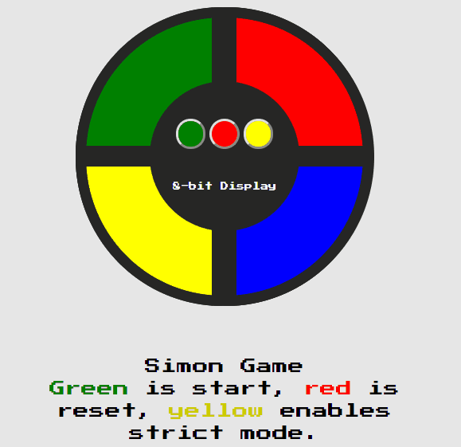

### Brief Overview of Topics Covered This Week
* The C# Beginner's course by Mosh
* Intermediate C# course by Mosh (started)
* Finished reading Alas, Babylon (great book)
* JavaScript Simon Game

## Mosh's C# Courses

As I mentioned in the previous post, I didn't continue learning
ASP.NET Core 2.x due to a lack of understanding of fundamentals in C#.
I also felt like most of the tutorials for ASP.NET Core 2.x expected
a prerequisite knowledge of ASP.NET MVC. So, I knew Mosh had some C# courses.
I've used them and am on the Intermediate course that expands on OOP concepts.
I feel that Mosh's courses are excellent. I had some prior knowledge of the concepts
so to solidify and prove to myself that I knew the concepts I started on the
exercises before reviewing that videos. If I felt I was missing something about
the topic I would go back and review the specific video. This meant I went
through the course a little bit faster. I will take his course on ASP.NET MVC 5
after I finish the Intermediate and Advanced C# courses. Mosh produces great
content on Udemy!

## Simon Game and the Various Problems I Had



After going through the [user stories ](https://learn.freecodecamp.org/coding-interview-prep/take-home-projects/build-a-simon-game/)
I figured I needed to solve it just like any other problem:
1. Carefully understand the user stories and requirements.
2. Understand the objects required. (still need to iterate over as
  my classes and objects are doing a lot of work by themselves)
3. Break down the requirements into smaller pieces. Example:
  * I need to get random button presses.
  * I need to store those random button presses.
  * I need to display the button presses, turning them on for 500ms and off
     for 500ms. Repeat this for all random button presses. Note: this was the
     most difficult part of this project for me for some reason.
  * Etc...


### Solving the Timing of the Button Presses

I've broken down the problem into various, simple tasks. I have the HTML and CSS
styling out of the way. The HTML/CSS was a learning experience in and of itself as
I originally though I would simply make an SVG. After reading through SVG and figuring
that I'd need to spend more time learning it than building the game logic I though about
how in the world I was going to get one big circle out of CSS. Well, you just add a
border-radius to the corners of container div's children.

Next step: show the computer button presses with `computerPress()` in the Game class.
I used a dummy array of random button sequences to simulate the game and give
`computerPress()` buttons to actually press. Next, how do I show the user that the
button is pressed? I simply made a CSS class with the styling of what I wanted a
pressed button to look like. Adding and removing this class with some CSS transitions
gave me the animation I was aiming for.


Below is the "lit" HTML class styling. I had an issue with specificity and this
is the first case were I've used !important on a project.
``` css
#green.lit {
  background-color: lighten(green, 20)   !important;
  box-shadow: inset 5px 2px 5px rgba(0, 0, 0, 0.5);
}

#blue.lit {
  background-color: lighten(blue, 20)    !important;
  box-shadow: inset 5px 2px 5px rgba(0, 0, 0, 0.5);
}

#red.lit {
  background-color: lighten(red, 20)     !important;
  box-shadow: inset 5px 2px 5px rgba(0, 0, 0, 0.5);
}

#yellow.lit {
  background-color: lighten(yellow, 20)  !important;
  box-shadow: inset 5px 2px 5px rgba(0, 0, 0, 0.5);
}
```

Timing the button presses I figured would be simple, just iterate through each
button I wanted to press and add a `setInterval()` for that button at about 500ms
to add the "lit" class. Why I thought this would work is beyond me. I completely
lacked an understanding of the timing. My for loop would run so quickly that all
buttons would turn on and off and roughly the same time. Well, I guess the computer
did what it should've done. Anyways, I was trying to use `setInterval()` for a repetitive
process. While you can do that using a recursive `setInterval()`, the simplest
way was to use `setInterval()` with a `setInterval()` to remove the "lit" class.
The following code is how I accomplished the appropriate timing:

 ``` js
 if(!this.playersTurn && this.isStarted) {
   let i = 0;
   let btn = this.seriesOfButtons
   // setInterval to toggle
   let interval = setInterval(function () {
     // simulatePress will add the class lit to the parameter given
     // and then set a timeout function to remove that class that is
     // half the time of the interval
     simulatedPress(this.seriesOfButtons[i]);
     i++;

     if(i >= this.gameCount) {
       clearInterval(interval);
       this.playersTurn = true;
       this.playerPress();
     }
   }.bind(this), 800); // bind this to give access to Game object
 } else {
   throw `is not players turn or game isn't running`
 }
 ```
My google-fu has, yet again, saved me from a couple gray hairs.

#### Function.prototype.bind();
Due to scoping issues that I completely lack an understanding of, my `setInterval()`
and `setTimeout()` functionality kept getting broken. The scope of my function inside
my timers where the Window object. I furiously tried to bypass this with some
seriously awful code. Making parameters to functions that just contained this.
What I found out about was the `Function.prototype.bind()` function that if called
on a function will create the same function except that the `this` keyword will
now refer to the parameter of .bind(). This allowed me to control the scope. I
believe I will be picking up Kyle Simpson's *You Don't Know JavaScript*. That way
I have a better understanding of JavaScript and won't be fumbling around feeling
like I understand nothing about what I'm writing. Which, to be honest, is exactly
how I felt making the Simon Game.

## Conclusion

Next week, I'll be gone visiting some friends. I hope to finish the Intermediate
C# course by Mosh. I'm not sure if I will take his Advanced C# course before moving
onto his ASP.NET MVC 5 course. I will also finish the Simon Game completely as
currently I just have the game logic working and not the start, stop, reset, and
strict mode functionality yet. Have a nice week!
